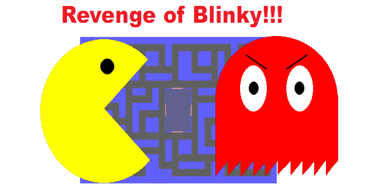

# Pacman: Revenge of Blinky
<p align="center">
    
</p>
This game originally comprised my final project for Computer Science 50, which was 
an introductory CS class at Harvard College and my first exposure to computer 
programming. It was completed as a group project alongside Nikolas Cable and Andrew
Sun, both of whom were also new to programming.

## Motivation
The project guidelines were very open-ended, encouraging us to essentially build 
something cool using the basic coding principles we had learned throughout the year.
We were also strongly encouraged to program in a language we had not used before, as
one of the stated goals of the course was for us to "learn how to learn," taking the
skillsets we had and applying them to new domains. The rest of the course had been
taught primarily in C, with a brief introduction to javascript, so we decided to make
a simple website with an embedded game to get more familiar with front-end web
development.  While the final product is pretty basic, it is always fun to look back
at it and see how far we've come.  

## Playing the Game
Though the original game was just a collection of HTML pages and JS scripts, I have 
since wrapped it up as a [Flask](https://flask.palletsprojects.com/en/1.1.x/) app
and deployed it on my [pythonanywhere](http://bhenderson.pythonanywhere.com/) site.  

The [Documentation.txt](Documentation.txt) and [Design.txt](Design.txt) files were original
requirements for project submission. The Documentation file specifically has some useful info
about how to play the game and how the sprites move around. 

## Installation
If you would like to run the game on your laptop or play around with the code, the
easiest way is to clone or fork this repository.

```git clone git@github.com:brettrhenderson/pacboi.git```

I would then recommend setting up a python virtualenv just to handle the Flask install, which 
currently just serves the webpages on your localhost. I have run it with python 3.7, but it should
really work with any version over 3.5 or so. 

```python3 -m venv  pacmanenv```

where you can replace pacmanenv with the path to wherever you would like that virtual environment
stored.  Then activate the virtualenvironment.

```source pacmanenv/bin/activate```

and make sure your terminal prompt is preceded by the name of the virtualenv in parentheses.
Now upgrade pip and set up your environment with flask.  From the project root

```
pip install --upgrade pip
pip install -r requirements.txt   
```

To run the game, boot up the flask server

```python pacman.py```

and navigate to `http://localhost:5000` in your browser.

## Making Changes
Tweak the HTML and javascript as much as you want! The Flask server is in debug mode by default,
so it will reload changes that you make to the HTML templates or the python code. As long as you 
disable caching for localhost:5000 in your browser, the changes should be reflected in the output.